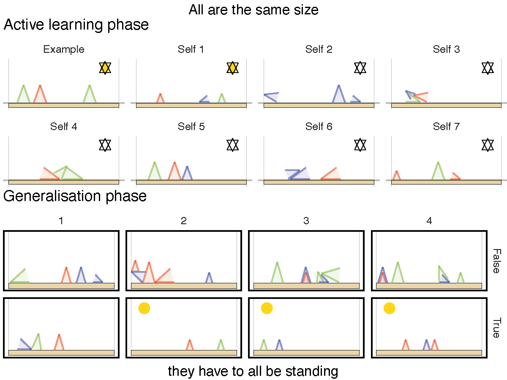

# Computational Constructivism

## Overview of files

- `complete_vizualizations_all_trial.zip` see 
- complete_visualizations_all_trials.zip
- data_fresps_coded_and_encoded_first_coder.csv
- data_fresps_coded_second_coder.csv
- data_fresps_disagreements.csv
- data_fresps_disagreements_resolved.csv
- results_processed.rdata

## Experiment

- [Demo of adults' version of the experiment](https://eco.ppls.ed.ac.uk/~nbramley/zendo_kas/demo.html) -- with option to skip the instruction section.
- [Children's version](https://eco.ppls.ed.ac.uk/~nbramley/zendo_kids/task.html)
